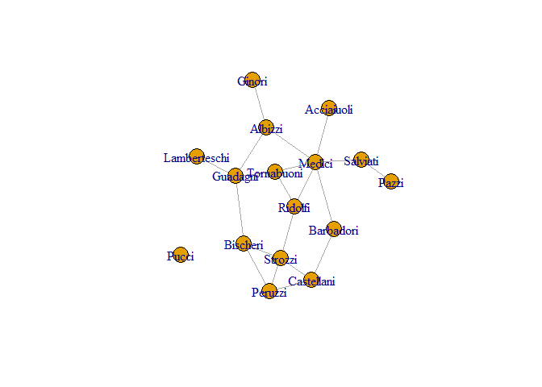

Social Network Analysis: Centrality Measures Example with the Medici
Network
================
Sabrina NardinLoizos Bitsikokos
2024-03-31

# Introduction

For this tutorial, we use the Florentine families dataset by Padget &
Ansell, 1993 (reading on Canvas). This is a network composed of marriage
links.

Our goal is to practice getting and manipulating network data, explore
network statistics, centrality measures and network visualization
techniques. These are some of the most fundamental skills needed in
network analysis and the tutorial is designed in a way to provide
universal skills in extracting, entering, and analyzing network data.

You are encouraged to tweak and modify the code on your own to practice.

# Setup

We were doing analyses in `igraph` but the Medici wedding network comes
with `statnet`, so let’s first import `statnet` along with other
libraries we will be using throughout the code.

``` r
knitr::opts_chunk$set(echo = TRUE, message=FALSE)
library(statnet) 
library(kableExtra)
```

# Loading network data

The network data we are using are pre-loaded in `statnet.` Therefore, we
can just call `data(flo)` to get a variable `flo` in our Environment
containing the network’s adjacency matrix:

``` r
# load Medici data stored as symmetric adjacency matrix
data(flo)

# display data, more pretty with kable()
flo %>% kable()
```

<table>
<thead>
<tr>
<th style="text-align:left;">
</th>
<th style="text-align:right;">
Acciaiuoli
</th>
<th style="text-align:right;">
Albizzi
</th>
<th style="text-align:right;">
Barbadori
</th>
<th style="text-align:right;">
Bischeri
</th>
<th style="text-align:right;">
Castellani
</th>
<th style="text-align:right;">
Ginori
</th>
<th style="text-align:right;">
Guadagni
</th>
<th style="text-align:right;">
Lamberteschi
</th>
<th style="text-align:right;">
Medici
</th>
<th style="text-align:right;">
Pazzi
</th>
<th style="text-align:right;">
Peruzzi
</th>
<th style="text-align:right;">
Pucci
</th>
<th style="text-align:right;">
Ridolfi
</th>
<th style="text-align:right;">
Salviati
</th>
<th style="text-align:right;">
Strozzi
</th>
<th style="text-align:right;">
Tornabuoni
</th>
</tr>
</thead>
<tbody>
<tr>
<td style="text-align:left;">
Acciaiuoli
</td>
<td style="text-align:right;">
0
</td>
<td style="text-align:right;">
0
</td>
<td style="text-align:right;">
0
</td>
<td style="text-align:right;">
0
</td>
<td style="text-align:right;">
0
</td>
<td style="text-align:right;">
0
</td>
<td style="text-align:right;">
0
</td>
<td style="text-align:right;">
0
</td>
<td style="text-align:right;">
1
</td>
<td style="text-align:right;">
0
</td>
<td style="text-align:right;">
0
</td>
<td style="text-align:right;">
0
</td>
<td style="text-align:right;">
0
</td>
<td style="text-align:right;">
0
</td>
<td style="text-align:right;">
0
</td>
<td style="text-align:right;">
0
</td>
</tr>
<tr>
<td style="text-align:left;">
Albizzi
</td>
<td style="text-align:right;">
0
</td>
<td style="text-align:right;">
0
</td>
<td style="text-align:right;">
0
</td>
<td style="text-align:right;">
0
</td>
<td style="text-align:right;">
0
</td>
<td style="text-align:right;">
1
</td>
<td style="text-align:right;">
1
</td>
<td style="text-align:right;">
0
</td>
<td style="text-align:right;">
1
</td>
<td style="text-align:right;">
0
</td>
<td style="text-align:right;">
0
</td>
<td style="text-align:right;">
0
</td>
<td style="text-align:right;">
0
</td>
<td style="text-align:right;">
0
</td>
<td style="text-align:right;">
0
</td>
<td style="text-align:right;">
0
</td>
</tr>
<tr>
<td style="text-align:left;">
Barbadori
</td>
<td style="text-align:right;">
0
</td>
<td style="text-align:right;">
0
</td>
<td style="text-align:right;">
0
</td>
<td style="text-align:right;">
0
</td>
<td style="text-align:right;">
1
</td>
<td style="text-align:right;">
0
</td>
<td style="text-align:right;">
0
</td>
<td style="text-align:right;">
0
</td>
<td style="text-align:right;">
1
</td>
<td style="text-align:right;">
0
</td>
<td style="text-align:right;">
0
</td>
<td style="text-align:right;">
0
</td>
<td style="text-align:right;">
0
</td>
<td style="text-align:right;">
0
</td>
<td style="text-align:right;">
0
</td>
<td style="text-align:right;">
0
</td>
</tr>
<tr>
<td style="text-align:left;">
Bischeri
</td>
<td style="text-align:right;">
0
</td>
<td style="text-align:right;">
0
</td>
<td style="text-align:right;">
0
</td>
<td style="text-align:right;">
0
</td>
<td style="text-align:right;">
0
</td>
<td style="text-align:right;">
0
</td>
<td style="text-align:right;">
1
</td>
<td style="text-align:right;">
0
</td>
<td style="text-align:right;">
0
</td>
<td style="text-align:right;">
0
</td>
<td style="text-align:right;">
1
</td>
<td style="text-align:right;">
0
</td>
<td style="text-align:right;">
0
</td>
<td style="text-align:right;">
0
</td>
<td style="text-align:right;">
1
</td>
<td style="text-align:right;">
0
</td>
</tr>
<tr>
<td style="text-align:left;">
Castellani
</td>
<td style="text-align:right;">
0
</td>
<td style="text-align:right;">
0
</td>
<td style="text-align:right;">
1
</td>
<td style="text-align:right;">
0
</td>
<td style="text-align:right;">
0
</td>
<td style="text-align:right;">
0
</td>
<td style="text-align:right;">
0
</td>
<td style="text-align:right;">
0
</td>
<td style="text-align:right;">
0
</td>
<td style="text-align:right;">
0
</td>
<td style="text-align:right;">
1
</td>
<td style="text-align:right;">
0
</td>
<td style="text-align:right;">
0
</td>
<td style="text-align:right;">
0
</td>
<td style="text-align:right;">
1
</td>
<td style="text-align:right;">
0
</td>
</tr>
<tr>
<td style="text-align:left;">
Ginori
</td>
<td style="text-align:right;">
0
</td>
<td style="text-align:right;">
1
</td>
<td style="text-align:right;">
0
</td>
<td style="text-align:right;">
0
</td>
<td style="text-align:right;">
0
</td>
<td style="text-align:right;">
0
</td>
<td style="text-align:right;">
0
</td>
<td style="text-align:right;">
0
</td>
<td style="text-align:right;">
0
</td>
<td style="text-align:right;">
0
</td>
<td style="text-align:right;">
0
</td>
<td style="text-align:right;">
0
</td>
<td style="text-align:right;">
0
</td>
<td style="text-align:right;">
0
</td>
<td style="text-align:right;">
0
</td>
<td style="text-align:right;">
0
</td>
</tr>
<tr>
<td style="text-align:left;">
Guadagni
</td>
<td style="text-align:right;">
0
</td>
<td style="text-align:right;">
1
</td>
<td style="text-align:right;">
0
</td>
<td style="text-align:right;">
1
</td>
<td style="text-align:right;">
0
</td>
<td style="text-align:right;">
0
</td>
<td style="text-align:right;">
0
</td>
<td style="text-align:right;">
1
</td>
<td style="text-align:right;">
0
</td>
<td style="text-align:right;">
0
</td>
<td style="text-align:right;">
0
</td>
<td style="text-align:right;">
0
</td>
<td style="text-align:right;">
0
</td>
<td style="text-align:right;">
0
</td>
<td style="text-align:right;">
0
</td>
<td style="text-align:right;">
1
</td>
</tr>
<tr>
<td style="text-align:left;">
Lamberteschi
</td>
<td style="text-align:right;">
0
</td>
<td style="text-align:right;">
0
</td>
<td style="text-align:right;">
0
</td>
<td style="text-align:right;">
0
</td>
<td style="text-align:right;">
0
</td>
<td style="text-align:right;">
0
</td>
<td style="text-align:right;">
1
</td>
<td style="text-align:right;">
0
</td>
<td style="text-align:right;">
0
</td>
<td style="text-align:right;">
0
</td>
<td style="text-align:right;">
0
</td>
<td style="text-align:right;">
0
</td>
<td style="text-align:right;">
0
</td>
<td style="text-align:right;">
0
</td>
<td style="text-align:right;">
0
</td>
<td style="text-align:right;">
0
</td>
</tr>
<tr>
<td style="text-align:left;">
Medici
</td>
<td style="text-align:right;">
1
</td>
<td style="text-align:right;">
1
</td>
<td style="text-align:right;">
1
</td>
<td style="text-align:right;">
0
</td>
<td style="text-align:right;">
0
</td>
<td style="text-align:right;">
0
</td>
<td style="text-align:right;">
0
</td>
<td style="text-align:right;">
0
</td>
<td style="text-align:right;">
0
</td>
<td style="text-align:right;">
0
</td>
<td style="text-align:right;">
0
</td>
<td style="text-align:right;">
0
</td>
<td style="text-align:right;">
1
</td>
<td style="text-align:right;">
1
</td>
<td style="text-align:right;">
0
</td>
<td style="text-align:right;">
1
</td>
</tr>
<tr>
<td style="text-align:left;">
Pazzi
</td>
<td style="text-align:right;">
0
</td>
<td style="text-align:right;">
0
</td>
<td style="text-align:right;">
0
</td>
<td style="text-align:right;">
0
</td>
<td style="text-align:right;">
0
</td>
<td style="text-align:right;">
0
</td>
<td style="text-align:right;">
0
</td>
<td style="text-align:right;">
0
</td>
<td style="text-align:right;">
0
</td>
<td style="text-align:right;">
0
</td>
<td style="text-align:right;">
0
</td>
<td style="text-align:right;">
0
</td>
<td style="text-align:right;">
0
</td>
<td style="text-align:right;">
1
</td>
<td style="text-align:right;">
0
</td>
<td style="text-align:right;">
0
</td>
</tr>
<tr>
<td style="text-align:left;">
Peruzzi
</td>
<td style="text-align:right;">
0
</td>
<td style="text-align:right;">
0
</td>
<td style="text-align:right;">
0
</td>
<td style="text-align:right;">
1
</td>
<td style="text-align:right;">
1
</td>
<td style="text-align:right;">
0
</td>
<td style="text-align:right;">
0
</td>
<td style="text-align:right;">
0
</td>
<td style="text-align:right;">
0
</td>
<td style="text-align:right;">
0
</td>
<td style="text-align:right;">
0
</td>
<td style="text-align:right;">
0
</td>
<td style="text-align:right;">
0
</td>
<td style="text-align:right;">
0
</td>
<td style="text-align:right;">
1
</td>
<td style="text-align:right;">
0
</td>
</tr>
<tr>
<td style="text-align:left;">
Pucci
</td>
<td style="text-align:right;">
0
</td>
<td style="text-align:right;">
0
</td>
<td style="text-align:right;">
0
</td>
<td style="text-align:right;">
0
</td>
<td style="text-align:right;">
0
</td>
<td style="text-align:right;">
0
</td>
<td style="text-align:right;">
0
</td>
<td style="text-align:right;">
0
</td>
<td style="text-align:right;">
0
</td>
<td style="text-align:right;">
0
</td>
<td style="text-align:right;">
0
</td>
<td style="text-align:right;">
0
</td>
<td style="text-align:right;">
0
</td>
<td style="text-align:right;">
0
</td>
<td style="text-align:right;">
0
</td>
<td style="text-align:right;">
0
</td>
</tr>
<tr>
<td style="text-align:left;">
Ridolfi
</td>
<td style="text-align:right;">
0
</td>
<td style="text-align:right;">
0
</td>
<td style="text-align:right;">
0
</td>
<td style="text-align:right;">
0
</td>
<td style="text-align:right;">
0
</td>
<td style="text-align:right;">
0
</td>
<td style="text-align:right;">
0
</td>
<td style="text-align:right;">
0
</td>
<td style="text-align:right;">
1
</td>
<td style="text-align:right;">
0
</td>
<td style="text-align:right;">
0
</td>
<td style="text-align:right;">
0
</td>
<td style="text-align:right;">
0
</td>
<td style="text-align:right;">
0
</td>
<td style="text-align:right;">
1
</td>
<td style="text-align:right;">
1
</td>
</tr>
<tr>
<td style="text-align:left;">
Salviati
</td>
<td style="text-align:right;">
0
</td>
<td style="text-align:right;">
0
</td>
<td style="text-align:right;">
0
</td>
<td style="text-align:right;">
0
</td>
<td style="text-align:right;">
0
</td>
<td style="text-align:right;">
0
</td>
<td style="text-align:right;">
0
</td>
<td style="text-align:right;">
0
</td>
<td style="text-align:right;">
1
</td>
<td style="text-align:right;">
1
</td>
<td style="text-align:right;">
0
</td>
<td style="text-align:right;">
0
</td>
<td style="text-align:right;">
0
</td>
<td style="text-align:right;">
0
</td>
<td style="text-align:right;">
0
</td>
<td style="text-align:right;">
0
</td>
</tr>
<tr>
<td style="text-align:left;">
Strozzi
</td>
<td style="text-align:right;">
0
</td>
<td style="text-align:right;">
0
</td>
<td style="text-align:right;">
0
</td>
<td style="text-align:right;">
1
</td>
<td style="text-align:right;">
1
</td>
<td style="text-align:right;">
0
</td>
<td style="text-align:right;">
0
</td>
<td style="text-align:right;">
0
</td>
<td style="text-align:right;">
0
</td>
<td style="text-align:right;">
0
</td>
<td style="text-align:right;">
1
</td>
<td style="text-align:right;">
0
</td>
<td style="text-align:right;">
1
</td>
<td style="text-align:right;">
0
</td>
<td style="text-align:right;">
0
</td>
<td style="text-align:right;">
0
</td>
</tr>
<tr>
<td style="text-align:left;">
Tornabuoni
</td>
<td style="text-align:right;">
0
</td>
<td style="text-align:right;">
0
</td>
<td style="text-align:right;">
0
</td>
<td style="text-align:right;">
0
</td>
<td style="text-align:right;">
0
</td>
<td style="text-align:right;">
0
</td>
<td style="text-align:right;">
1
</td>
<td style="text-align:right;">
0
</td>
<td style="text-align:right;">
1
</td>
<td style="text-align:right;">
0
</td>
<td style="text-align:right;">
0
</td>
<td style="text-align:right;">
0
</td>
<td style="text-align:right;">
1
</td>
<td style="text-align:right;">
0
</td>
<td style="text-align:right;">
0
</td>
<td style="text-align:right;">
0
</td>
</tr>
</tbody>
</table>

We can also export the matrix in a `csv` file:

``` r
write.csv(flo, file = "flo.csv")
```

and we can also import data from a `csv` file:

``` r
flo_df <- read.csv("flo.csv", 
                   header = TRUE, 
                   row.names = 1, # data has row names stored in first column
                   as.is = TRUE)  # do not convert character into factor
```

This `flo_df` object is actually a data.frame. We can turn this back
into a matrix like so:

``` r
# turn df into matrix
flo_matrix <- as.matrix(flo_df)
mode(flo_matrix) <- "numeric"

# display
flo_matrix %>% kable()
```

<table>
<thead>
<tr>
<th style="text-align:left;">
</th>
<th style="text-align:right;">
Acciaiuoli
</th>
<th style="text-align:right;">
Albizzi
</th>
<th style="text-align:right;">
Barbadori
</th>
<th style="text-align:right;">
Bischeri
</th>
<th style="text-align:right;">
Castellani
</th>
<th style="text-align:right;">
Ginori
</th>
<th style="text-align:right;">
Guadagni
</th>
<th style="text-align:right;">
Lamberteschi
</th>
<th style="text-align:right;">
Medici
</th>
<th style="text-align:right;">
Pazzi
</th>
<th style="text-align:right;">
Peruzzi
</th>
<th style="text-align:right;">
Pucci
</th>
<th style="text-align:right;">
Ridolfi
</th>
<th style="text-align:right;">
Salviati
</th>
<th style="text-align:right;">
Strozzi
</th>
<th style="text-align:right;">
Tornabuoni
</th>
</tr>
</thead>
<tbody>
<tr>
<td style="text-align:left;">
Acciaiuoli
</td>
<td style="text-align:right;">
0
</td>
<td style="text-align:right;">
0
</td>
<td style="text-align:right;">
0
</td>
<td style="text-align:right;">
0
</td>
<td style="text-align:right;">
0
</td>
<td style="text-align:right;">
0
</td>
<td style="text-align:right;">
0
</td>
<td style="text-align:right;">
0
</td>
<td style="text-align:right;">
1
</td>
<td style="text-align:right;">
0
</td>
<td style="text-align:right;">
0
</td>
<td style="text-align:right;">
0
</td>
<td style="text-align:right;">
0
</td>
<td style="text-align:right;">
0
</td>
<td style="text-align:right;">
0
</td>
<td style="text-align:right;">
0
</td>
</tr>
<tr>
<td style="text-align:left;">
Albizzi
</td>
<td style="text-align:right;">
0
</td>
<td style="text-align:right;">
0
</td>
<td style="text-align:right;">
0
</td>
<td style="text-align:right;">
0
</td>
<td style="text-align:right;">
0
</td>
<td style="text-align:right;">
1
</td>
<td style="text-align:right;">
1
</td>
<td style="text-align:right;">
0
</td>
<td style="text-align:right;">
1
</td>
<td style="text-align:right;">
0
</td>
<td style="text-align:right;">
0
</td>
<td style="text-align:right;">
0
</td>
<td style="text-align:right;">
0
</td>
<td style="text-align:right;">
0
</td>
<td style="text-align:right;">
0
</td>
<td style="text-align:right;">
0
</td>
</tr>
<tr>
<td style="text-align:left;">
Barbadori
</td>
<td style="text-align:right;">
0
</td>
<td style="text-align:right;">
0
</td>
<td style="text-align:right;">
0
</td>
<td style="text-align:right;">
0
</td>
<td style="text-align:right;">
1
</td>
<td style="text-align:right;">
0
</td>
<td style="text-align:right;">
0
</td>
<td style="text-align:right;">
0
</td>
<td style="text-align:right;">
1
</td>
<td style="text-align:right;">
0
</td>
<td style="text-align:right;">
0
</td>
<td style="text-align:right;">
0
</td>
<td style="text-align:right;">
0
</td>
<td style="text-align:right;">
0
</td>
<td style="text-align:right;">
0
</td>
<td style="text-align:right;">
0
</td>
</tr>
<tr>
<td style="text-align:left;">
Bischeri
</td>
<td style="text-align:right;">
0
</td>
<td style="text-align:right;">
0
</td>
<td style="text-align:right;">
0
</td>
<td style="text-align:right;">
0
</td>
<td style="text-align:right;">
0
</td>
<td style="text-align:right;">
0
</td>
<td style="text-align:right;">
1
</td>
<td style="text-align:right;">
0
</td>
<td style="text-align:right;">
0
</td>
<td style="text-align:right;">
0
</td>
<td style="text-align:right;">
1
</td>
<td style="text-align:right;">
0
</td>
<td style="text-align:right;">
0
</td>
<td style="text-align:right;">
0
</td>
<td style="text-align:right;">
1
</td>
<td style="text-align:right;">
0
</td>
</tr>
<tr>
<td style="text-align:left;">
Castellani
</td>
<td style="text-align:right;">
0
</td>
<td style="text-align:right;">
0
</td>
<td style="text-align:right;">
1
</td>
<td style="text-align:right;">
0
</td>
<td style="text-align:right;">
0
</td>
<td style="text-align:right;">
0
</td>
<td style="text-align:right;">
0
</td>
<td style="text-align:right;">
0
</td>
<td style="text-align:right;">
0
</td>
<td style="text-align:right;">
0
</td>
<td style="text-align:right;">
1
</td>
<td style="text-align:right;">
0
</td>
<td style="text-align:right;">
0
</td>
<td style="text-align:right;">
0
</td>
<td style="text-align:right;">
1
</td>
<td style="text-align:right;">
0
</td>
</tr>
<tr>
<td style="text-align:left;">
Ginori
</td>
<td style="text-align:right;">
0
</td>
<td style="text-align:right;">
1
</td>
<td style="text-align:right;">
0
</td>
<td style="text-align:right;">
0
</td>
<td style="text-align:right;">
0
</td>
<td style="text-align:right;">
0
</td>
<td style="text-align:right;">
0
</td>
<td style="text-align:right;">
0
</td>
<td style="text-align:right;">
0
</td>
<td style="text-align:right;">
0
</td>
<td style="text-align:right;">
0
</td>
<td style="text-align:right;">
0
</td>
<td style="text-align:right;">
0
</td>
<td style="text-align:right;">
0
</td>
<td style="text-align:right;">
0
</td>
<td style="text-align:right;">
0
</td>
</tr>
<tr>
<td style="text-align:left;">
Guadagni
</td>
<td style="text-align:right;">
0
</td>
<td style="text-align:right;">
1
</td>
<td style="text-align:right;">
0
</td>
<td style="text-align:right;">
1
</td>
<td style="text-align:right;">
0
</td>
<td style="text-align:right;">
0
</td>
<td style="text-align:right;">
0
</td>
<td style="text-align:right;">
1
</td>
<td style="text-align:right;">
0
</td>
<td style="text-align:right;">
0
</td>
<td style="text-align:right;">
0
</td>
<td style="text-align:right;">
0
</td>
<td style="text-align:right;">
0
</td>
<td style="text-align:right;">
0
</td>
<td style="text-align:right;">
0
</td>
<td style="text-align:right;">
1
</td>
</tr>
<tr>
<td style="text-align:left;">
Lamberteschi
</td>
<td style="text-align:right;">
0
</td>
<td style="text-align:right;">
0
</td>
<td style="text-align:right;">
0
</td>
<td style="text-align:right;">
0
</td>
<td style="text-align:right;">
0
</td>
<td style="text-align:right;">
0
</td>
<td style="text-align:right;">
1
</td>
<td style="text-align:right;">
0
</td>
<td style="text-align:right;">
0
</td>
<td style="text-align:right;">
0
</td>
<td style="text-align:right;">
0
</td>
<td style="text-align:right;">
0
</td>
<td style="text-align:right;">
0
</td>
<td style="text-align:right;">
0
</td>
<td style="text-align:right;">
0
</td>
<td style="text-align:right;">
0
</td>
</tr>
<tr>
<td style="text-align:left;">
Medici
</td>
<td style="text-align:right;">
1
</td>
<td style="text-align:right;">
1
</td>
<td style="text-align:right;">
1
</td>
<td style="text-align:right;">
0
</td>
<td style="text-align:right;">
0
</td>
<td style="text-align:right;">
0
</td>
<td style="text-align:right;">
0
</td>
<td style="text-align:right;">
0
</td>
<td style="text-align:right;">
0
</td>
<td style="text-align:right;">
0
</td>
<td style="text-align:right;">
0
</td>
<td style="text-align:right;">
0
</td>
<td style="text-align:right;">
1
</td>
<td style="text-align:right;">
1
</td>
<td style="text-align:right;">
0
</td>
<td style="text-align:right;">
1
</td>
</tr>
<tr>
<td style="text-align:left;">
Pazzi
</td>
<td style="text-align:right;">
0
</td>
<td style="text-align:right;">
0
</td>
<td style="text-align:right;">
0
</td>
<td style="text-align:right;">
0
</td>
<td style="text-align:right;">
0
</td>
<td style="text-align:right;">
0
</td>
<td style="text-align:right;">
0
</td>
<td style="text-align:right;">
0
</td>
<td style="text-align:right;">
0
</td>
<td style="text-align:right;">
0
</td>
<td style="text-align:right;">
0
</td>
<td style="text-align:right;">
0
</td>
<td style="text-align:right;">
0
</td>
<td style="text-align:right;">
1
</td>
<td style="text-align:right;">
0
</td>
<td style="text-align:right;">
0
</td>
</tr>
<tr>
<td style="text-align:left;">
Peruzzi
</td>
<td style="text-align:right;">
0
</td>
<td style="text-align:right;">
0
</td>
<td style="text-align:right;">
0
</td>
<td style="text-align:right;">
1
</td>
<td style="text-align:right;">
1
</td>
<td style="text-align:right;">
0
</td>
<td style="text-align:right;">
0
</td>
<td style="text-align:right;">
0
</td>
<td style="text-align:right;">
0
</td>
<td style="text-align:right;">
0
</td>
<td style="text-align:right;">
0
</td>
<td style="text-align:right;">
0
</td>
<td style="text-align:right;">
0
</td>
<td style="text-align:right;">
0
</td>
<td style="text-align:right;">
1
</td>
<td style="text-align:right;">
0
</td>
</tr>
<tr>
<td style="text-align:left;">
Pucci
</td>
<td style="text-align:right;">
0
</td>
<td style="text-align:right;">
0
</td>
<td style="text-align:right;">
0
</td>
<td style="text-align:right;">
0
</td>
<td style="text-align:right;">
0
</td>
<td style="text-align:right;">
0
</td>
<td style="text-align:right;">
0
</td>
<td style="text-align:right;">
0
</td>
<td style="text-align:right;">
0
</td>
<td style="text-align:right;">
0
</td>
<td style="text-align:right;">
0
</td>
<td style="text-align:right;">
0
</td>
<td style="text-align:right;">
0
</td>
<td style="text-align:right;">
0
</td>
<td style="text-align:right;">
0
</td>
<td style="text-align:right;">
0
</td>
</tr>
<tr>
<td style="text-align:left;">
Ridolfi
</td>
<td style="text-align:right;">
0
</td>
<td style="text-align:right;">
0
</td>
<td style="text-align:right;">
0
</td>
<td style="text-align:right;">
0
</td>
<td style="text-align:right;">
0
</td>
<td style="text-align:right;">
0
</td>
<td style="text-align:right;">
0
</td>
<td style="text-align:right;">
0
</td>
<td style="text-align:right;">
1
</td>
<td style="text-align:right;">
0
</td>
<td style="text-align:right;">
0
</td>
<td style="text-align:right;">
0
</td>
<td style="text-align:right;">
0
</td>
<td style="text-align:right;">
0
</td>
<td style="text-align:right;">
1
</td>
<td style="text-align:right;">
1
</td>
</tr>
<tr>
<td style="text-align:left;">
Salviati
</td>
<td style="text-align:right;">
0
</td>
<td style="text-align:right;">
0
</td>
<td style="text-align:right;">
0
</td>
<td style="text-align:right;">
0
</td>
<td style="text-align:right;">
0
</td>
<td style="text-align:right;">
0
</td>
<td style="text-align:right;">
0
</td>
<td style="text-align:right;">
0
</td>
<td style="text-align:right;">
1
</td>
<td style="text-align:right;">
1
</td>
<td style="text-align:right;">
0
</td>
<td style="text-align:right;">
0
</td>
<td style="text-align:right;">
0
</td>
<td style="text-align:right;">
0
</td>
<td style="text-align:right;">
0
</td>
<td style="text-align:right;">
0
</td>
</tr>
<tr>
<td style="text-align:left;">
Strozzi
</td>
<td style="text-align:right;">
0
</td>
<td style="text-align:right;">
0
</td>
<td style="text-align:right;">
0
</td>
<td style="text-align:right;">
1
</td>
<td style="text-align:right;">
1
</td>
<td style="text-align:right;">
0
</td>
<td style="text-align:right;">
0
</td>
<td style="text-align:right;">
0
</td>
<td style="text-align:right;">
0
</td>
<td style="text-align:right;">
0
</td>
<td style="text-align:right;">
1
</td>
<td style="text-align:right;">
0
</td>
<td style="text-align:right;">
1
</td>
<td style="text-align:right;">
0
</td>
<td style="text-align:right;">
0
</td>
<td style="text-align:right;">
0
</td>
</tr>
<tr>
<td style="text-align:left;">
Tornabuoni
</td>
<td style="text-align:right;">
0
</td>
<td style="text-align:right;">
0
</td>
<td style="text-align:right;">
0
</td>
<td style="text-align:right;">
0
</td>
<td style="text-align:right;">
0
</td>
<td style="text-align:right;">
0
</td>
<td style="text-align:right;">
1
</td>
<td style="text-align:right;">
0
</td>
<td style="text-align:right;">
1
</td>
<td style="text-align:right;">
0
</td>
<td style="text-align:right;">
0
</td>
<td style="text-align:right;">
0
</td>
<td style="text-align:right;">
1
</td>
<td style="text-align:right;">
0
</td>
<td style="text-align:right;">
0
</td>
<td style="text-align:right;">
0
</td>
</tr>
</tbody>
</table>

Check that running `class(flomatrix)` returns the class: matrix, array

# Network Analysis

## Building the Network

The following code illustrates how to convert the dataset into a network
object and plot the initial network graph.

``` r
# detach "statnet" and attach "igraph" for the analysis
# you can also run centrality measures with "statnet" rather than "igraph", see Luke's book
detach("package:statnet", unload=TRUE)
library(igraph)

# convert adj matrix "flo" to an igraph object
nflo <- graph_from_adjacency_matrix(flo, mode = "undirected")   
```

Check that running `class(nflo)` returns: igraph.

We can also plot the graph:

``` r
# display
plot(nflo, displaylabels=TRUE, boxed.labels=FALSE, label.cex=0.75)
```

<!-- -->

## Network properties

We can also get all kinds of summary statistics directly through
`igraph`. You are advised to dig into the documentation on your own, but
here are a couple of useful measures:

- Graph size: `gsize(nflo)` = 20.
- Graph density: `graph.density(nflo)` = 0.1666667
- Graph diameter: `diameter(nflo)` = 5

Here are the summary statistics in a single code chunk for your
reference:

``` r
# some summary statistics in igraph
gsize(nflo)
graph.density(nflo)
diameter(nflo)
```

We can also access any attributes that the nodes/edges of the network
have through:

``` r
# access network attributes
edge_attr(nflo) # this is an empty list, there are no edge attributes
```

    ## named list()

``` r
vertex_attr(nflo) 
```

    ## $name
    ##  [1] "Acciaiuoli"   "Albizzi"      "Barbadori"    "Bischeri"     "Castellani"  
    ##  [6] "Ginori"       "Guadagni"     "Lamberteschi" "Medici"       "Pazzi"       
    ## [11] "Peruzzi"      "Pucci"        "Ridolfi"      "Salviati"     "Strozzi"     
    ## [16] "Tornabuoni"

Getting the nodes and and edges of the network is fairly simple, too:

``` r
V(nflo)  # 16 families
```

    ## + 16/16 vertices, named, from 07f9b3d:
    ##  [1] Acciaiuoli   Albizzi      Barbadori    Bischeri     Castellani  
    ##  [6] Ginori       Guadagni     Lamberteschi Medici       Pazzi       
    ## [11] Peruzzi      Pucci        Ridolfi      Salviati     Strozzi     
    ## [16] Tornabuoni

``` r
E(nflo)  # 20 ties
```

    ## + 20/20 edges from 07f9b3d (vertex names):
    ##  [1] Acciaiuoli--Medici       Albizzi   --Ginori       Albizzi   --Guadagni    
    ##  [4] Albizzi   --Medici       Barbadori --Castellani   Barbadori --Medici      
    ##  [7] Bischeri  --Guadagni     Bischeri  --Peruzzi      Bischeri  --Strozzi     
    ## [10] Castellani--Peruzzi      Castellani--Strozzi      Guadagni  --Lamberteschi
    ## [13] Guadagni  --Tornabuoni   Medici    --Ridolfi      Medici    --Salviati    
    ## [16] Medici    --Tornabuoni   Pazzi     --Salviati     Peruzzi   --Strozzi     
    ## [19] Ridolfi   --Strozzi      Ridolfi   --Tornabuoni

We can choose also present the network as an edge list:

``` r
as_edgelist(nflo)
```

    ##       [,1]         [,2]          
    ##  [1,] "Acciaiuoli" "Medici"      
    ##  [2,] "Albizzi"    "Ginori"      
    ##  [3,] "Albizzi"    "Guadagni"    
    ##  [4,] "Albizzi"    "Medici"      
    ##  [5,] "Barbadori"  "Castellani"  
    ##  [6,] "Barbadori"  "Medici"      
    ##  [7,] "Bischeri"   "Guadagni"    
    ##  [8,] "Bischeri"   "Peruzzi"     
    ##  [9,] "Bischeri"   "Strozzi"     
    ## [10,] "Castellani" "Peruzzi"     
    ## [11,] "Castellani" "Strozzi"     
    ## [12,] "Guadagni"   "Lamberteschi"
    ## [13,] "Guadagni"   "Tornabuoni"  
    ## [14,] "Medici"     "Ridolfi"     
    ## [15,] "Medici"     "Salviati"    
    ## [16,] "Medici"     "Tornabuoni"  
    ## [17,] "Pazzi"      "Salviati"    
    ## [18,] "Peruzzi"    "Strozzi"     
    ## [19,] "Ridolfi"    "Strozzi"     
    ## [20,] "Ridolfi"    "Tornabuoni"

or an adjacency matrix

``` r
as_adjacency_matrix(nflo)
```

    ## 16 x 16 sparse Matrix of class "dgCMatrix"
    ##                                             
    ## Acciaiuoli   . . . . . . . . 1 . . . . . . .
    ## Albizzi      . . . . . 1 1 . 1 . . . . . . .
    ## Barbadori    . . . . 1 . . . 1 . . . . . . .
    ## Bischeri     . . . . . . 1 . . . 1 . . . 1 .
    ## Castellani   . . 1 . . . . . . . 1 . . . 1 .
    ## Ginori       . 1 . . . . . . . . . . . . . .
    ## Guadagni     . 1 . 1 . . . 1 . . . . . . . 1
    ## Lamberteschi . . . . . . 1 . . . . . . . . .
    ## Medici       1 1 1 . . . . . . . . . 1 1 . 1
    ## Pazzi        . . . . . . . . . . . . . 1 . .
    ## Peruzzi      . . . 1 1 . . . . . . . . . 1 .
    ## Pucci        . . . . . . . . . . . . . . . .
    ## Ridolfi      . . . . . . . . 1 . . . . . 1 1
    ## Salviati     . . . . . . . . 1 1 . . . . . .
    ## Strozzi      . . . 1 1 . . . . . 1 . 1 . . .
    ## Tornabuoni   . . . . . . 1 . 1 . . . 1 . . .

or we could get the nodes and edges as dataframes:

``` r
e <- as_data_frame(nflo, what="edges")
v <- as_data_frame(nflo, what="vertices")

e %>% kable()
```

<table>
<thead>
<tr>
<th style="text-align:left;">
from
</th>
<th style="text-align:left;">
to
</th>
</tr>
</thead>
<tbody>
<tr>
<td style="text-align:left;">
Acciaiuoli
</td>
<td style="text-align:left;">
Medici
</td>
</tr>
<tr>
<td style="text-align:left;">
Albizzi
</td>
<td style="text-align:left;">
Ginori
</td>
</tr>
<tr>
<td style="text-align:left;">
Albizzi
</td>
<td style="text-align:left;">
Guadagni
</td>
</tr>
<tr>
<td style="text-align:left;">
Albizzi
</td>
<td style="text-align:left;">
Medici
</td>
</tr>
<tr>
<td style="text-align:left;">
Barbadori
</td>
<td style="text-align:left;">
Castellani
</td>
</tr>
<tr>
<td style="text-align:left;">
Barbadori
</td>
<td style="text-align:left;">
Medici
</td>
</tr>
<tr>
<td style="text-align:left;">
Bischeri
</td>
<td style="text-align:left;">
Guadagni
</td>
</tr>
<tr>
<td style="text-align:left;">
Bischeri
</td>
<td style="text-align:left;">
Peruzzi
</td>
</tr>
<tr>
<td style="text-align:left;">
Bischeri
</td>
<td style="text-align:left;">
Strozzi
</td>
</tr>
<tr>
<td style="text-align:left;">
Castellani
</td>
<td style="text-align:left;">
Peruzzi
</td>
</tr>
<tr>
<td style="text-align:left;">
Castellani
</td>
<td style="text-align:left;">
Strozzi
</td>
</tr>
<tr>
<td style="text-align:left;">
Guadagni
</td>
<td style="text-align:left;">
Lamberteschi
</td>
</tr>
<tr>
<td style="text-align:left;">
Guadagni
</td>
<td style="text-align:left;">
Tornabuoni
</td>
</tr>
<tr>
<td style="text-align:left;">
Medici
</td>
<td style="text-align:left;">
Ridolfi
</td>
</tr>
<tr>
<td style="text-align:left;">
Medici
</td>
<td style="text-align:left;">
Salviati
</td>
</tr>
<tr>
<td style="text-align:left;">
Medici
</td>
<td style="text-align:left;">
Tornabuoni
</td>
</tr>
<tr>
<td style="text-align:left;">
Pazzi
</td>
<td style="text-align:left;">
Salviati
</td>
</tr>
<tr>
<td style="text-align:left;">
Peruzzi
</td>
<td style="text-align:left;">
Strozzi
</td>
</tr>
<tr>
<td style="text-align:left;">
Ridolfi
</td>
<td style="text-align:left;">
Strozzi
</td>
</tr>
<tr>
<td style="text-align:left;">
Ridolfi
</td>
<td style="text-align:left;">
Tornabuoni
</td>
</tr>
</tbody>
</table>

## Subsetting nodes

We can also create a subnetwork by subsetting nodes from the initial
network based on a condition. Let’s say that we wanted to filter out
isolated nodes.

Let’s first find if there are isolated nodes:

``` r
# remove isolates and plot again
isol <- which(degree(nflo)==0)
isol
```

    ## Pucci 
    ##    12

Seems like Pucci is an isolated node in the graph (a node with no
edges).

We can go on and delete that node from the network and visualize it:

``` r
# delete Pucci
nflo2 <- delete.vertices(nflo, isol)

# visualize new subnetwork
plot(nflo2, displaylabels=TRUE, boxed.labels=FALSE, label.cex=0.75)
```

<!-- -->

## Centrality Measures

There are multiple centrality measures developed for network analysis.
We limit the discussion here, to a subset of popular measures that come
with `igraph`, known as the “big four” measures (degree, betweenness,
closeness, and eigenvector).

In the following, we introduce:

- Degree Centrality
  - In-degree
  - Out-degree
- Eigenvector Centrality
- Closeness Centrality
- Betweenness Centrality

### Degree Centrality

The simplest centrality measure is the degree of each node. A simple
interpretation for degree centrality is that each node is assigned a
centrality score of 1 for each of their neighbors.

``` r
# calculate 
degree(nflo2)
```

    ##   Acciaiuoli      Albizzi    Barbadori     Bischeri   Castellani       Ginori 
    ##            1            3            2            3            3            1 
    ##     Guadagni Lamberteschi       Medici        Pazzi      Peruzzi      Ridolfi 
    ##            4            1            6            1            3            3 
    ##     Salviati      Strozzi   Tornabuoni 
    ##            2            4            3

It might be useful to sort the value in decreasing order, to find the
most “central” nodes in the network:

``` r
# sort
sort(degree(nflo2), decreasing = TRUE)
```

    ##       Medici     Guadagni      Strozzi      Albizzi     Bischeri   Castellani 
    ##            6            4            4            3            3            3 
    ##      Peruzzi      Ridolfi   Tornabuoni    Barbadori     Salviati   Acciaiuoli 
    ##            3            3            3            2            2            1 
    ##       Ginori Lamberteschi        Pazzi 
    ##            1            1            1

We could also normalize centralities, directly through the `degree()`
function:

``` r
# degree centrality normalized
deg_n <- degree(nflo2, normalized = TRUE)
sort(deg_n, decreasing = TRUE)
```

    ##       Medici     Guadagni      Strozzi      Albizzi     Bischeri   Castellani 
    ##   0.42857143   0.28571429   0.28571429   0.21428571   0.21428571   0.21428571 
    ##      Peruzzi      Ridolfi   Tornabuoni    Barbadori     Salviati   Acciaiuoli 
    ##   0.21428571   0.21428571   0.21428571   0.14285714   0.14285714   0.07142857 
    ##       Ginori Lamberteschi        Pazzi 
    ##   0.07142857   0.07142857   0.07142857

or manually, like so:

``` r
# same thing
deg_n2 <- degree(nflo2, loops = FALSE) / (vcount(nflo2) - 1)
sort(deg_n2, decreasing = TRUE)
```

    ##       Medici     Guadagni      Strozzi      Albizzi     Bischeri   Castellani 
    ##   0.42857143   0.28571429   0.28571429   0.21428571   0.21428571   0.21428571 
    ##      Peruzzi      Ridolfi   Tornabuoni    Barbadori     Salviati   Acciaiuoli 
    ##   0.21428571   0.21428571   0.21428571   0.14285714   0.14285714   0.07142857 
    ##       Ginori Lamberteschi        Pazzi 
    ##   0.07142857   0.07142857   0.07142857

What’s the interpretation of these calculations?

### Eigenvector Centrality

Eigenvector centrality is based on the assumption that not all nodes on
the network are equal, hence the centrality of a node is increased if
its neighbors are also central (we assign to each node a centrality
score analogous to the sum of the scores of its neighbors).

To calculate it we can run, the following, where we also sorted in a
decreasing order:

``` r
# calculate and sort 
sort(evcent(nflo2, scale = FALSE)[[1]], decreasing = TRUE)
```

    ##       Medici      Strozzi      Ridolfi   Tornabuoni     Guadagni     Bischeri 
    ##   0.43030809   0.35598045   0.34155264   0.32584230   0.28911560   0.28280009 
    ##      Peruzzi   Castellani      Albizzi    Barbadori     Salviati   Acciaiuoli 
    ##   0.27573037   0.25902617   0.24395611   0.21170525   0.14591720   0.13215429 
    ## Lamberteschi       Ginori        Pazzi 
    ##   0.08879189   0.07492271   0.04481344

### Closeness Centrality

Closeness is a centrality measure a bit different from degree and
eigenvector, since it measures the mean distance between nodes.

To calculate it we can run:

``` r
# calculate and sort
sort(closeness(nflo2), decreasing = TRUE)
```

    ##       Medici      Ridolfi      Albizzi   Tornabuoni     Guadagni    Barbadori 
    ##   0.04000000   0.03571429   0.03448276   0.03448276   0.03333333   0.03125000 
    ##      Strozzi     Bischeri   Castellani     Salviati   Acciaiuoli      Peruzzi 
    ##   0.03125000   0.02857143   0.02777778   0.02777778   0.02631579   0.02631579 
    ##       Ginori Lamberteschi        Pazzi 
    ##   0.02380952   0.02325581   0.02040816

and it similarly normalized like so:

``` r
# normalize 
close_n <- closeness(nflo2, normalized = TRUE)
sort(close_n, decreasing = TRUE)
```

    ##       Medici      Ridolfi      Albizzi   Tornabuoni     Guadagni    Barbadori 
    ##    0.5600000    0.5000000    0.4827586    0.4827586    0.4666667    0.4375000 
    ##      Strozzi     Bischeri   Castellani     Salviati   Acciaiuoli      Peruzzi 
    ##    0.4375000    0.4000000    0.3888889    0.3888889    0.3684211    0.3684211 
    ##       Ginori Lamberteschi        Pazzi 
    ##    0.3333333    0.3255814    0.2857143

### Betweenness Centrality

Betweeness is a measure of how much each node lies in the paths between
other nodes.

To calculate it:

``` r
sort(betweenness(nflo2), decreasing = TRUE)
```

    ##       Medici     Guadagni      Albizzi     Salviati      Ridolfi     Bischeri 
    ##    47.500000    23.166667    19.333333    13.000000    10.333333     9.500000 
    ##      Strozzi    Barbadori   Tornabuoni   Castellani      Peruzzi   Acciaiuoli 
    ##     9.333333     8.500000     8.333333     5.000000     2.000000     0.000000 
    ##       Ginori Lamberteschi        Pazzi 
    ##     0.000000     0.000000     0.000000

and normalize:

``` r
# normalize 
btw_n <- betweenness(nflo2, normalized = TRUE)
sort(btw_n, decreasing = TRUE)
```

    ##       Medici     Guadagni      Albizzi     Salviati      Ridolfi     Bischeri 
    ##   0.52197802   0.25457875   0.21245421   0.14285714   0.11355311   0.10439560 
    ##      Strozzi    Barbadori   Tornabuoni   Castellani      Peruzzi   Acciaiuoli 
    ##   0.10256410   0.09340659   0.09157509   0.05494505   0.02197802   0.00000000 
    ##       Ginori Lamberteschi        Pazzi 
    ##   0.00000000   0.00000000   0.00000000

## Comparison of Centrality Measures

Since there are multiple ways to get centrality, each one based on its
own assumptions of what centrality is, it is very useful to compare them
in order to better understand which nodes are the most influential.

Let’s aggregate some measures in a dataframe:

``` r
# collect measures in a dataframe
all_centr <- data.frame(deg_n, close_n, btw_n)

# visualize
plot(all_centr)
```

<!-- -->

As we can see in the plot above, there are some clear relationships
between different centrality measures.

It is thus useful to checkout the correlation coefficients between
different measures:

``` r
cor(all_centr) %>% kable()
```

<table>
<thead>
<tr>
<th style="text-align:left;">
</th>
<th style="text-align:right;">
deg_n
</th>
<th style="text-align:right;">
close_n
</th>
<th style="text-align:right;">
btw_n
</th>
</tr>
</thead>
<tbody>
<tr>
<td style="text-align:left;">
deg_n
</td>
<td style="text-align:right;">
1.0000000
</td>
<td style="text-align:right;">
0.8245138
</td>
<td style="text-align:right;">
0.8441513
</td>
</tr>
<tr>
<td style="text-align:left;">
close_n
</td>
<td style="text-align:right;">
0.8245138
</td>
<td style="text-align:right;">
1.0000000
</td>
<td style="text-align:right;">
0.8066296
</td>
</tr>
<tr>
<td style="text-align:left;">
btw_n
</td>
<td style="text-align:right;">
0.8441513
</td>
<td style="text-align:right;">
0.8066296
</td>
<td style="text-align:right;">
1.0000000
</td>
</tr>
</tbody>
</table>

# Network Visualization

We already saw some ways to present a network through dataframes,
adjacency matrices, node and edge lists, and even visualized with dots
and lines. In the following we will focus on network visualization.

The most basic way to visualize a network is thorugh:

``` r
plot(nflo)
```

<!-- -->

## Adjust size and color

There are two ways to adjust size and color of nodes and edges.

### Option 1

Specify node & edge options in plot()

``` r
# set node and edge parameters
plot(nflo,
     # node parameters
     vertex.size = 15,
     vertex.color = "orange", 
     vertex.frame.color = NA,
     # edge parameters
     edge.arrow.size = 0.2,
     edge.color = "orange",
     edge.width = .7,
     edge.curved = .1)
```

<!-- -->

We can also adjust the label parameters:

``` r
plot(nflo, 
     # node parameters
     vertex.size = 15,
     vertex.color = "orange", 
     vertex.frame.color = NA,
     # edge parameters
     edge.arrow.size = 0.2,
     edge.color = "orange",
     edge.width = .7,
     edge.curved = .1,
     # label parameters
     vertex.label.cex = .7,   # node label size
     vertex.label.color = "black",
     vertex.label = V(nflo)$name, # set to NA to hide labels
     vertex.label.dist= 2)
```

<!-- -->

### Option 2

Add node and edge options to the igraph object:

``` r
# calculate degree 
deg <- degree(nflo, mode="all")

# save as a new node attribute, size, in nflo
V(nflo)$size <- deg*5

# add it to the previous plot
# copy/past code above: change vertex size to V(nflo)$size
plot(nflo, 
     # node parameters
     vertex.size = V(nflo)$size,
     vertex.color = "orange", 
     vertex.frame.color = NA,
     # edge parameters
     edge.arrow.size = 0.2,
     edge.color = "orange",
     edge.width = .7,
     edge.curved = .1,
     # label parameters
     vertex.label.cex = .7,   # node label size
     vertex.label.color = "black",
     vertex.label = V(nflo)$name, # set to NA to hide labels
     vertex.label.dist= 2)
```

<!-- -->

## Layouts

Another customization that we can do in the plot is change the layout of
nodes on the space.

For example, nodes can be arranged on a circle:

``` r
# circular
plot(nflo, layout = layout_in_circle, main = "Medici circle layout")
```

<!-- -->

or randomly:

``` r
# randomly
plot(nflo, layout = layout_randomly,  main ="Medici random layout")
```

<!-- -->

Another popular force directed layout it the Fruchterman-Reingold:

``` r
# layout_with_fr(nflo)
# par(mar = (c(0,0,0,0)))
plot(nflo, layout = layout_with_fr)
```

<!-- -->

We can also save the layout in a variable like so:

``` r
# save layout coordinates to get same results
fr <- layout_with_fr(nflo)  
fr
```

    ##             [,1]      [,2]
    ##  [1,]  3.0370455 1.9841014
    ##  [2,]  2.8132037 3.9054966
    ##  [3,]  0.1605422 2.3908409
    ##  [4,]  0.1942882 5.1885805
    ##  [5,] -0.9309379 3.3450340
    ##  [6,]  4.0010916 3.9605725
    ##  [7,]  1.7700855 5.0177916
    ##  [8,]  2.1793548 6.0940882
    ##  [9,]  1.8090587 2.6255943
    ## [10,]  1.6786462 0.2113560
    ## [11,] -1.0079206 4.6267181
    ## [12,] -1.1556252 0.9147466
    ## [13,]  0.8292901 3.4442549
    ## [14,]  1.8455741 1.2067139
    ## [15,] -0.2842646 4.1718831
    ## [16,]  1.7291366 3.8440710

and then plot:

``` r
plot(nflo, layout = fr)
```

<!-- -->

Setting a seed will make the visualization reproducible (the layout will
be the same across runs):

``` r
# set seed to make it reproducible
set.seed(1)
fr <- layout_with_fr(nflo)  
plot(nflo, layout = fr)
```

<!-- -->
Feel free to incorporate all the previous information in your custom
plot by adding a layout parameter.

## Removing loops

``` r
# set margin parameters
par(mar = (c(0,0,0,0)))
# plot(nflo, layout = fr)

# remove loops
nflo <- simplify(nflo, remove.multiple = F, remove.loops = T) 

# remove isolates and plot again
isol <- which(degree(nflo)==0)
nflo2 <- delete.vertices(nflo, isol)
plot(nflo2, displaylabels=TRUE, label.cex=0.75)
```

<!-- -->

# Additional resources and tips

## igraph

- Check the documentation!
- Luke’s book Chapters 4, 5, and 6
- Katya Ognayanova Vis in igraph tutorial
  <https://kateto.net/network-visualization>

notes: - igraph is better than statnet for plotting but you can plot
with statnet as well: - see Oganyanova tutorial above and Luke’s book
for more - you can also integrate igraph with ggplot2: - to do so, see:
5.2 A ggraph package example (for ggplot2 users) in Oganyanova tutorial
above

## Gephi

- Visualizations in [Gephi](https://gephi.org/)  
- Katya Ognayanova Vis in Gephi
  [tutorial](https://kateto.net/wp-content/uploads/2016/04/Gephi%20Handout%20Sunbelt%202016.pdf)

# Sources

- Murphy, P., & Knapp, B. (2020). RPubs - Centrality in statnet.
  Rpubs.com. <https://rpubs.com/pjmurphy/546652>
- Murphy, P., & Knapp, B. (2021). RPubs - Centrality Options in igraph.
  Rpubs.com. <https://rpubs.com/pjmurphy/igraphCentrality>
- Newman, M. (2010). *Networks: An Introduction*. Oxford University
  Press.
- Padgett, J. F., & Ansell, C. K. (1993). Robust Action and the Rise of
  the Medici, 1400-1434. *American Journal of Sociology, 98*(6),
  1259–1319. <https://doi.org/10.1086/230190>
- [Use Case: Florentine
  Families](https://cran.r-project.org/web/packages/netrankr/vignettes/use_case.html)
